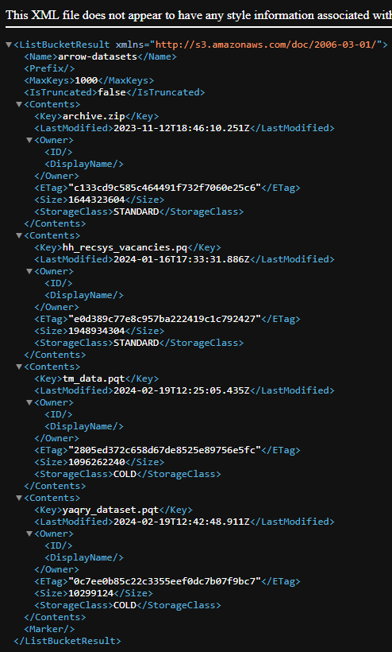
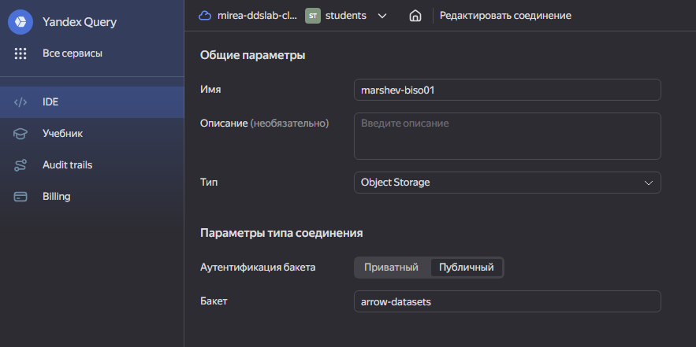
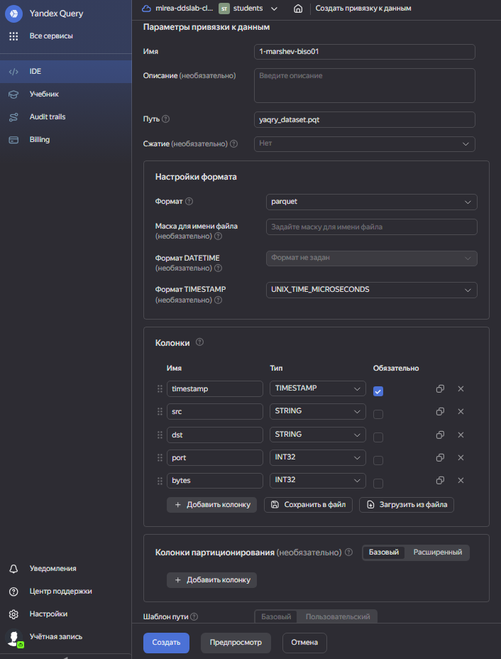
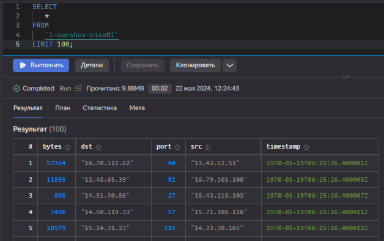
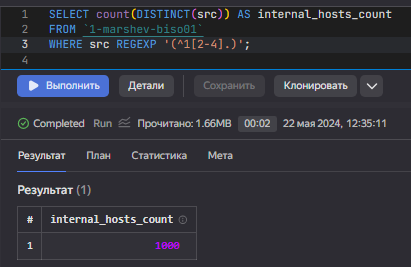
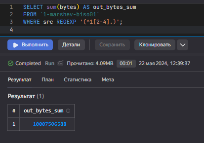
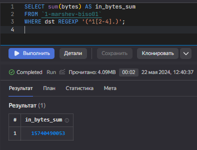

Применение технологий искусственного интеллекта и машинного обучения для
поиска угроз информационной безопасности
================
Marshev Leonid

# Лабораторная работа №1

Использование технологии Yandex Query для анализа данных сетевой
активности

## Цель работы

1\. Изучить возможности технологии Yandex Query для анализа
структурированных наборов данных

2\. Получить навыки построения аналитического пайплайна для анализа
данных с помощью сервисов Yandex Cloud

3\. Закрепить практические навыки использования SQL для анализа данных
сетевой активности в сегментированной корпоративной сети

## Исходные данные

1.  ОС Windows 10
2.  RStudio Desktop 2023.03.1 Build 446
3.  Yandex Cloud: S3 Object Storage
4.  Yandex Query
5.  Dataset: yaqry_dataset.pqt

## Ход работы

### Проверить доступность данных в Yandex Object Storage

Проверьте доступность данных (файл yaqry_dataset.pqt) в бакете
arrow-datasets S3 хранилища Yandex Object Storage. Проверить можно
просто перейдя по правильно сконструированному URL в браузере.

https://storage.yandexcloud.net/arrow-datasets/yaqry_dataset.pqt



### Подключить бакет как источник данных для Yandex Query

Yandex Query – это облачное решение для анализа данных, в котором задачи
организации хранения, обеспечения доступа и выполнения первичного
анализа данных полностью берет на себя сервис-провайдер, то есть Yandex
Cloud.

1\. Создадим соединение для бакета в S3 хранилище

2\. Заполняем поля с учетом допустимых символов, выбираем тип
аутентификации. Вводим имя бакета в соответствующее поле и сохраняем



3\. Укажем какой объект использовать в качестве источника данных. Для
этого нужно сделать привязку данных.

4\. Настройка привязки данных

5\. Описание состава и формата входных данных



Если настройка выполнена правильно, то получится выполнить аналитический
запрос. Результат должен быть непустым

``` sql
SELECT * FROM `1-marshev-biso01` LIMIT 100;
```



### Анализ

1\. Известно, что IP адреса внутренней сети начинаются с октетов
принадлежащих интервалу \[12-14\]. Определите количество хостов
внутренней сети, представленных в датасете.

Для этого выполним запрос, который будет отбирать из источников только
определенные IP и считать их количество.

``` sql
SELECT count(DISTINCT(src)) AS internal_hosts_count
FROM `1-marshev-biso01`
WHERE src REGEXP '(^1[2-4].)';
```



2\. Определите суммарный объем исходящего трафика

Для этого необходимо суммировать байты трафика, исходящих IP которых
находитсяя во внутренней сети, а IP приемника отличается. Сразу
пересчитаем в МБ

``` sql
SELECT sum(bytes) AS out_bytes_sum
FROM `1-marshev-biso01`
WHERE src REGEXP '(^1[2-4].)';
```



3\. Определите суммарный объем входящего трафика

Для этого необходимо суммировать байты трафика, который приходит на IP
внутренней сети, но источник не принадлежит ей. Сразу пересчитаем в МБ

``` sql
SELECT sum(bytes) AS in_bytes_sum
FROM `1-marshev-biso01`
WHERE dst REGEXP '(^1[2-4].)';
```



``` r
sprintf("Done")
```

    [1] "Done"

## Оценка результатов

Задача выполнена при помощи облачных сервисов Yandex Cloud и технологии
Yandex Query, удалось познакомится с их функционалом и особенностями.

# Вывод

В результате выполнения практической работы закрепили практические
навыки использования языка запросов SQL для анализа данных сетевой
активности в сегментированной корпоративной сети и получили навыки
построения аналитического пайплайна для анализа данных.
