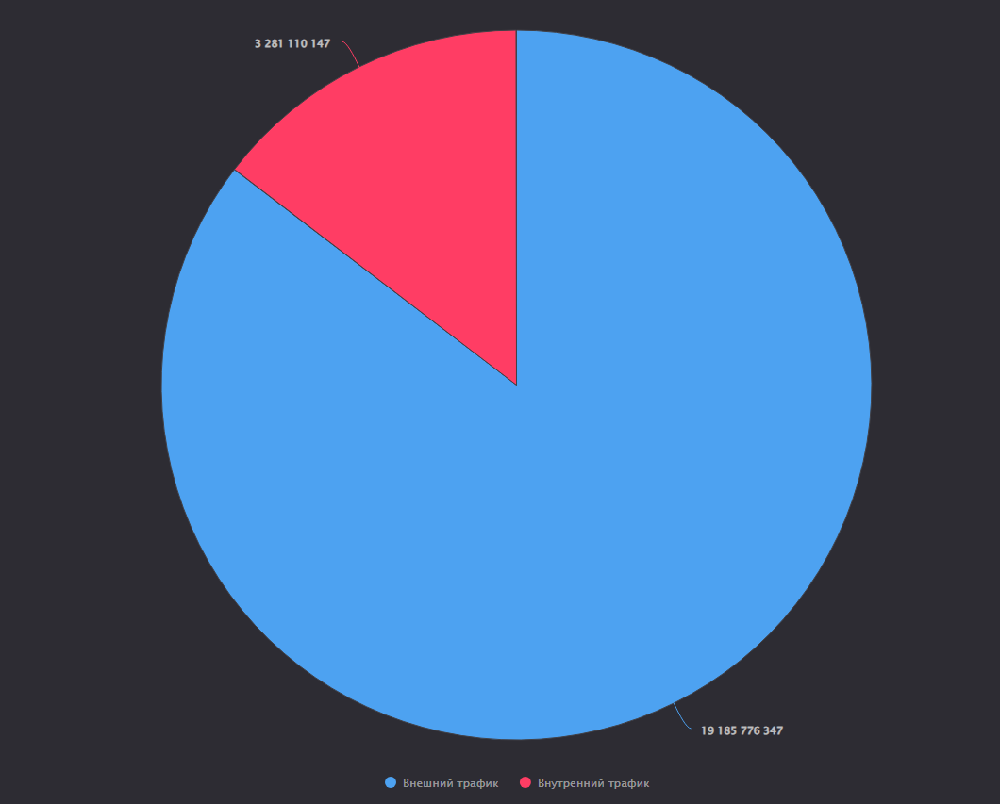

Применение технологий искусственного интеллекта и машинного обучения для
поиска угроз информационной безопасности
================
Маршев Леонид

# Лабораторная работа №2

Использование технологии Yandex DataLens для анализа данных сетевой
активности

Дашборд: https://datalens.yandex/

## Цель работы

1\. Изучить возможности технологии Yandex DataLens для визуального
анализа структурированных наборов данных.

2\. Получить навыки визуализации данных для последующего анализа с
помощью сервисов Yandex Cloud.

3\. Получить навыки создания решений мониторинга/SIEM на базе облачных
продуктов и открытых программных решений.

4\. Закрепить практические навыки использования SQL для анализа данных
сетевой активности в сегментированной корпоративной сети.

## Задание

Используя сервис Yandex DataLens настроить доступ к результатам Yandex
Query, полученным в ходе выполнения практической работы №1, и визуально
представить результаты анализа данных.

## Задачи

1\. Представить в виде круговой диаграммы соотношение внешнего и
внутреннего сетевого трафика.

2\. Представить в виде столбчатой диаграммы соотношение входящего и
исходящего трафика из внутреннего сетвого сегмента.

3\. Построить график активности (линейная диаграмма) объема трафика во
времени.

4\. Все построенные графики вывести в виде единого дашборда в Yandex
DataLens.

## Ход работы

### Настроить подключение к Yandex Query из DataLens

1\. Переходим на сервис – https://datalens.yandex.ru/

2\. Выбраем “Подключения” – “Создать новое подключение”

3\. В разделе “Файлы и сервисы” выбираем Yandex Query

4\. Настраиваем и проверяем подключение


### Создать из запроса YandexQuery датасет DataLens


### Делаем нужные графики и диаграммы

В DataLens они называются чартами.

-   Круговая диаграмма соотношения внешнего и внутреннего сетевого
    трафика. (Внутренняя сеть с IP-адресами 12… 13… 14…)

<!-- -->

    IF (([src] LIKE '12.%' OR [src] LIKE '13.%' OR [src] LIKE '14.%') AND ([dst] LIKE '12.%' OR [dst] LIKE '13.%' OR [dst] LIKE '14.%'))
      THEN 'Внутренний трафик'
    ELSE
      'Внешний трафик'
    END




-   Представить в виде столбчатой диаграммы соотношение входящего и
    исходящего трафика из внутреннего сетвого сегмента.

<!-- -->

    IF (LEFT([src], 3) IN ('12.', '13.', '14.') AND LEFT([dst], 3) NOT IN ('12.', '13.', '14.'))
        THEN 'Исходящий трафик'
    ELSEIF (LEFT([dst], 3) IN ('12.', '13.', '14.') AND LEFT([src], 3) NOT IN ('12.', '13.', '14.'))
        THEN 'Входящий трафик'
    ELSE
        'Нераспознанный трафик'
    END


-   Построить график активности (линейная диаграмма) объема трафика во
    времени.

Необходимо преобразовать поле с временем, для отображения достаточно
секунд. Логика прокраски из предыдущего запроса.


-   Все построенные графики вывести в виде единого дашборда в Yandex
    DataLens.

``` r
sprintf("Done")
```

    [1] "Done"

## Оценка результатов

Было создано несколько графиков на основе предоставленного набора
данных, а также был создан дашборд, объединяющий эти графики.

Он доступен по ссылке: https://datalens.yandex/

## Вывод

В результате выполнения практической работы были изучены возможности
сервиса Yandex DataLens для визуального анализа структурированных
наборов данных. Получены навыки создания решений мониторинга/SIEM на
базе облачных решений. Закреплены практические навыки использования
SQL-запросов для анализа данных сетевой активности в сегментированной
корпоративной сети.
